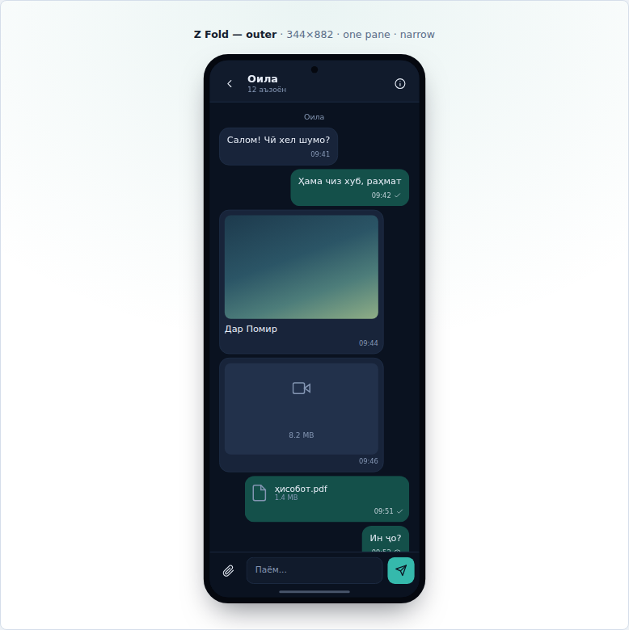

# Sakina

A messenger for Tajikistan, built so it can become a super-app without being
rebuilt.

Telegram-shaped to begin with: fast, reliable on a bad connection, and speaking
Russian, Tajik and English.
Structured from the first commit so that payments, utility bills and mini-apps
arrive as message types on the same bus rather than as a second product bolted
alongside.

## Running it

Requires Node 22+, pnpm 10+, and Docker.

```bash
pnpm install
pnpm infra:up          # postgres + redis + minio
pnpm build
pnpm db:migrate
pnpm dev               # api :4000, gateway :4001, worker :4003
```

Verify the whole thing works:

```bash
pnpm test        # 125 checks: auth, ban evasion, messaging, push, groups,
                 # channels, media, localisation, Dart sanity
pnpm test:devices  # the layout at 31 real device sizes, in a real browser
pnpm bench       # frame rate and gateway latency, with pass/fail bars
```

### See it without running anything

[`docs/prototype/index.html`](docs/prototype/index.html) — open it in a browser.
Every screen, at six real device sizes, in all three languages, in both themes.
It is HTML rendering the same palette, strings and layout rules the Flutter
client uses, so it is accurate — but it is a prototype, not the app.



### Run the real client

To actually *see it work* — no Flutter SDK, no emulator, no phone:

```bash
pnpm dev:client  # http://localhost:4002
```

Open it in two tabs, sign in with two different emails, copy one user id into
the other tab, and chat. Full guide in [`docs/TESTING.md`](docs/TESTING.md).


Those cover the cases that actually matter on Tajik mobile data — a retried send
whose ack was lost, a client coming back after being offline — plus every email
variant resolving to one account, and a ban surviving a new address on the same
handset.

## Signing in without a Tajik SIM

Sign-in is by **email** for now — +992 SMS cannot be received from outside the
country. Phone is still in the model and comes back at launch.

Locally, `OTP_DEV_MODE=true` returns the verification code in the response, so
nothing needs configuring. For anything shared, set `TEST_IDENTITIES` — fixed
identity/code pairs that skip delivery in every environment. Those are also what
App Store and Play reviewers use, since they cannot receive a Tajik SMS either.

Email being a weak identity is a real problem, not a footnote: one Gmail mailbox
can be written a dozen ways and each one would otherwise be a free extra account.
Addresses are canonicalised per provider, disposable domains are refused, signups
are capped per device and per network, and the beta can run invite-only.
See [`docs/ANTI-ABUSE.md`](docs/ANTI-ABUSE.md).

The mobile app needs a one-time setup — see [`apps/mobile/README.md`](apps/mobile/README.md).

## Layout

```
apps/mobile      Flutter client — the product
apps/web         Next.js — web client and landing
services/api     Fastify: auth, chats, history
services/gateway WebSocket: realtime delivery
services/worker  push notifications for closed apps
packages/protocol  The wire contract (zod schemas + types)
packages/core      Domain logic and repositories
packages/db        Drizzle schema and migrations
infra            Postgres, Redis, MinIO, coturn
```

## Design

Read them in this order:

- [`docs/ARCHITECTURE.md`](docs/ARCHITECTURE.md) — the decisions that are
  expensive to reverse, and why
- [`docs/PROTOCOL.md`](docs/PROTOCOL.md) — the wire contract, authoritative for
  both TypeScript and Dart
- [`docs/ROADMAP.md`](docs/ROADMAP.md) — what is built, what is next, and what is
  deliberately deferred
- [`docs/COMPETITIVE-ANALYSIS.md`](docs/COMPETITIVE-ANALYSIS.md) — seven
  messengers, what to take from each, and three market findings that change the
  plan
- [`docs/GROWTH.md`](docs/GROWTH.md) — the plan to 10,000 users
- [`docs/BACKLOG.md`](docs/BACKLOG.md) — 111 things missing, from skeleton
  screens to voice calls, with an argument for the order
- [`docs/DIFFERENTIATION.md`](docs/DIFFERENTIATION.md) — what would make it
  chosen rather than merely complete, and eight things we should not build
- [`docs/BRAND.md`](docs/BRAND.md) — the visual identity: the chorkhona mark,
  firuza on night, and the six glyphs that decide the font
- [`docs/UX.md`](docs/UX.md) — Telegram-shaped, checked against Nielsen's heuristics
- [`docs/DEVICES.md`](docs/DEVICES.md) — running on everything from a Galaxy A15
  to an iPhone 17 Pro Max, and how that is verified without the phones
- [`docs/MEDIA.md`](docs/MEDIA.md) — photos, videos and files, and why the bytes
  never touch the API
- [`docs/DELIVERY.md`](docs/DELIVERY.md) — how a message actually reaches the
  other person, and the one gap that matters
- [`docs/PUSH.md`](docs/PUSH.md) — notifications when the app is closed, and the
  Firebase setup you have to do yourself
- [`docs/CALLS.md`](docs/CALLS.md) — voice and video: WebRTC, and why CGNAT
  decides the cost
- [`docs/ANTI-ABUSE.md`](docs/ANTI-ABUSE.md) — one person, one account
- [`docs/BANS.md`](docs/BANS.md) — making a ban survive a new address
- [`docs/TESTING.md`](docs/TESTING.md) — how to run and see all of it
- [`docs/PERFORMANCE.md`](docs/PERFORMANCE.md) — the 60fps work, with before and
  after numbers

The short version: the network is the enemy, so the client's local database is
what the UI reads from and every write is idempotent. Money will be handled by a
licensed partner for years, so the ledger schema exists now and stays empty. A
super-app is a chat app with extensible message types, so the message type enum
and `users.kind` are open from the first commit.

## Status

M0 is complete and verified: two people can exchange messages, and it holds up
across retries, reconnects and restarts. Sign-in works from anywhere via email,
with duplicate-account detection. Push notifications reach a closed app — the
server path is tested end to end; the Firebase project and a real handset are
yours to set up (see [`docs/PUSH.md`](docs/PUSH.md)). The Flutter client is
written but has not been compiled — see its README.

The nearest thing to a deadline: WhatsApp — the most-used messenger in
Tajikistan — has been blocked in Russia since February 2026, where a large share
of the country's families have someone working. That conversation is broken right
now. See [`docs/COMPETITIVE-ANALYSIS.md`](docs/COMPETITIVE-ANALYSIS.md).
