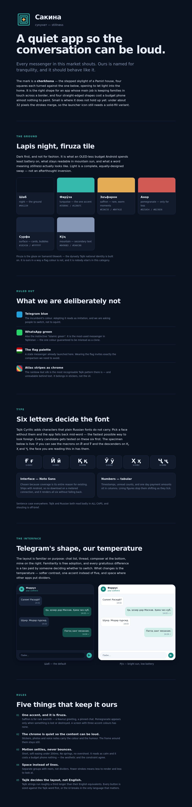

# Visual identity

**A quiet app so the conversation can be loud.**

Every messenger in this market shouts. Ours is named for tranquility —
سكينة / сукунат — and the whole system follows from taking that literally. Being
calm is not a mood board here; it is the one thing none of the competition is.

The rendered version of this document, with live swatches and both themes side
by side, is [`docs/brand/identity.html`](brand/identity.html).

---

## The mark

A **chorkhona** — the stepped skylight of a Pamiri house. Four squares, each
turned against the one below, opening to let light into the home.

It was chosen over the obvious options because it is the only one that is
actually *about* this product. Sakina's main job is keeping families in touch
across a border, and a skylight is a hole cut in a roof so that light gets in.
It is also four straight-edged shapes, which costs almost nothing to paint on a
budget phone — a paper plane does not.

It sheds tiers rather than shrinking. Three nested outlines inside 24 logical
pixels merge into a blob, so at small sizes the mark drops to the outer square,
the single 45° turn that makes the shape recognisable, and the core. That is what
lets the same widget sit in an app bar and on a splash screen without a second
asset.

Implemented as `ChorkhonaMark` in `apps/mobile/lib/src/theme.dart`, drawn on a
canvas rather than shipped as an asset.

## Colour

Dark first, and not for fashion. It is what a budget Android spends least
battery on, what stays readable in mountain sun, and what a word meaning
*stillness* actually looks like. Light is a complete, equally-designed swap, not
an inversion.

| | Role | Dark | Light |
| --- | --- | --- | --- |
| **Шаб** — night | the ground | `#0A1220` | `#F4F7FB` |
| **Сурфа** — surface | cards, bubbles | `#18243A` | `#FFFFFF` |
| **Фирӯза** — turquoise | the one accent | `#35B9AC` | `#12867C` |
| **Заъфарон** — saffron | rare warmth | `#E3AC55` | `#B07A1E` |
| **Анор** — pomegranate | only for loss | `#D25A54` | `#B23B36` |
| **Кӯҳ** — mountain | secondary text | `#8496B3` | `#5A6C88` |

Firuza is the glaze on Samanid tilework — the dynasty Tajik national identity is
built on. It is ours in a way a flag colour is not, and it belongs to nobody else
in this category.

### What was ruled out, and why

- **Telegram blue.** The incumbent's colour. Adopting it reads as imitation, and
  we are asking people to switch, not to squint.
- **WhatsApp green** — which is also the instinctive "Islamic green". WhatsApp is
  the most-used messenger in Tajikistan; it is the one colour guaranteed to be
  misread as a clone.
- **The flag palette.** A state messenger already launched here in 2025. Wearing
  the flag invites exactly the comparison we need to avoid — see
  [`COMPETITIVE-ANALYSIS.md`](COMPETITIVE-ANALYSIS.md).
- **Atlas/adras stripes as chrome.** The rainbow ikat silk is the most
  recognisable Tajik pattern there is, and completely unreadable behind text. It
  belongs in stickers, not the interface.

## Type

**Noto Sans**, because coverage is its entire reason for existing.

Tajik Cyrillic adds six characters that plain Russian fonts do not carry:

> **Ғ ғ · Ӣ ӣ · Қ қ · Ӯ ӯ · Ҳ ҳ · Ҷ ҷ**

Pick a face without them and the app falls back mid-word — the fastest possible
way to look foreign in the only language that matters. Every font candidate gets
tested on these first. Noto ships with Android, so there is nothing to download
on a metered connection.

Numbers are tabular: timestamps, unread counts and eventually payment amounts sit
in columns, and lining figures stop them shifting as they tick.

Sentence case everywhere. Tajik and Russian both read badly in ALL CAPS, and
shouting is off-brief.

## Five rules

1. **One accent, and it is firuza.** Saffron is for rare warmth — a Navruz
   greeting, a pinned chat. Pomegranate appears only when something is lost or
   destroyed. A screen with three accent colours has none.
2. **The chrome is quiet so the content can be loud.** Stickers, photos and voice
   notes carry the colour and the humour; the frame around them stays still.
   This is also why stickers are high on the roadmap — see
   [`GROWTH.md`](GROWTH.md).
3. **Motion settles, never bounces.** The whole vocabulary is
   `apps/mobile/lib/src/motion.dart`: durations named for what they are for
   (`quick`, `base`, `travel`, `long`), decelerating curves, and no springs or
   overshoot anywhere. Calm and cheap happen to be the same setting here, which
   is not usually how it goes.

   Two rules that are enforced rather than hoped for, by `pnpm test:motion`:
   every animating file must reach the reduce-motion gate, and every duration
   must come from the vocabulary rather than being written at the call site.
   The gate returns exactly `Duration.zero` — shortening an animation is not
   the same as disabling it.

   Haptics are part of the same vocabulary and follow one rule: **they confirm,
   they never decorate.** Nothing vibrates for anything the user did not
   personally cause. A buzz for an incoming message is what notifications are
   for, and doubling it is how an app becomes the one that will not stop
   vibrating.
4. **Space instead of lines.** Separate groups with room, not dividers. Fewer
   strokes means less to render and less to look at.
5. **Tajik decides the layout, not English.** Tajik strings run roughly a third
   longer than their English equivalents. Every button is sized against the Tajik
   word first, or the UI breaks in the language it exists for.

## Where it lives

| | |
| --- | --- |
| `apps/mobile/lib/src/theme.dart` | The whole system: colours, `SakinaPalette`, both `ThemeData`s, and the mark |
| `tools/dev-client/index.html` | The same palette, so the browser client matches |
| `docs/brand/identity.html` | The rendered identity, both themes |

Bubble colours are a named `ThemeExtension` rather than Material's
`primaryContainer`, deliberately: reading them off the generated scheme means
changing a seed colour would quietly restyle the conversation.

## Not yet decided

- **The app icon.** The chorkhona is the mark; turning it into a launcher icon
  that survives Android's adaptive-icon masking is separate work.
- **Sticker art direction.** This is where atlas stripes, pomegranates and Navruz
  belong, and it needs a Tajik illustrator rather than a spec.
- **A wordmark in Perso-Arabic script** (سكينة). Worth having for the diaspora and
  for anywhere the name appears alongside Persian or Arabic.
- **Whether light should be the default** for users outside the Pamirs. Dark is
  the design's home, but the choice is testable and should be tested.
