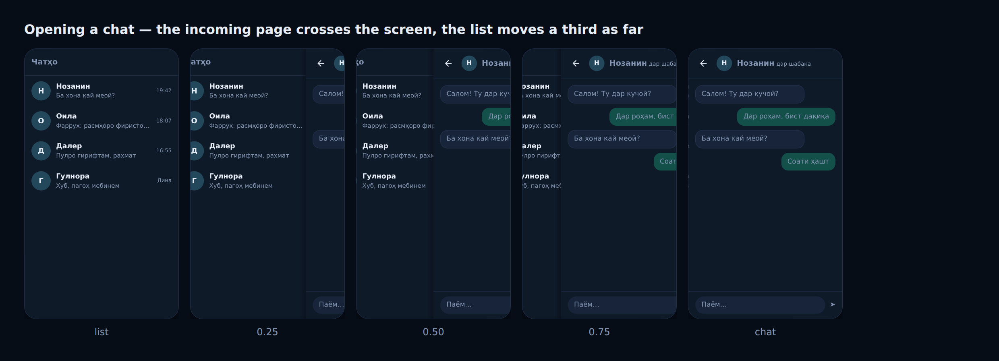

# Motion

> Everyone else moves things. We light them.

Live specimens, with a reduce-motion toggle:
[`docs/brand/motion.html`](brand/motion.html).

The tokens are in `apps/mobile/lib/src/motion.dart`, the widgets in
`apps/mobile/lib/src/ui/motion_primitives.dart`, and `pnpm test:motion` fails
the build if either is bypassed.

---

## Where this comes from

Not from a mood board. From one fact about our own mark, already written down in
[`BRAND.md`](BRAND.md): **a chorkhona is not a shape, it is an opening that lets
light into a house.**

Take that literally and the motion language follows. Every other messenger
expresses change by *moving* something — Telegram springs, iMessage inflates,
Material slides a container. If our mark is an opening for light, then our way
of saying something happened is to **light it**.

That turns out to be both the more distinctive choice and the quieter one, which
is the first time on this project those two have pointed the same way. A bubble
that lights up does not move; nothing reflows; the conversation stays still. An
app named for stillness should probably not bounce.

## The three primitives

### ТОБ — the light pass

A single band of firuza crosses a surface at 45°, once, in 320ms, and is gone.

It fires when something becomes **true**: a message acked, a receipt read, an
upload finished, a channel joined. It replaces the tick popping in — the tick
still lands, because that is the part a screen reader and a stopped animation
can both carry, but the *arrival* is the light.

**Why this is not a shimmer, and why that matters.** A loading shimmer loops
while you wait, and the design-tells catalogue is right to call it a cliché used
as decoration. This is its semantic opposite: **it runs once, on success, and
never while waiting.** If it ever loops, it stops meaning "arrived" and we have
built the exact tell we were avoiding. That is the single rule most likely to be
broken by someone adding a flourish to a button, and it is the one worth
defending.

### НАФАС — the breath

The thing being waited on breathes: opacity 0.55 → 1.0 over 900ms, alternating.

A spinner is an object that is *not* the thing you care about, placed next to
the thing you care about, moving. Breathing lets the object in doubt say so
itself — one fewer element on screen, and nothing competing with the
conversation.

Alternating rather than looping, because a sawtooth snaps back to dim at the top
of every cycle and that snap is exactly the flashing this avoids.

Applies to a pending message, an upload in flight, and the skeleton blocks that
were already doing this before the language had a name for it.

### ЧАРХ — the turn

The mark rotates 45° and holds. Eight positions, 110ms of turn and 120ms of
hold, 1840ms to a revolution.

Every loading indicator in the world spins smoothly. Ours steps, and the reason
is not only stylistic: **the chorkhona has four-fold symmetry, so a smooth spin
would look almost static.** Stepping makes it visibly turn, and 45° is the
smallest rotation that returns the shape to a face — so the silhouette
alternates square and diamond on every step. It reads as deliberate rather than
anxious, which is the difference between a spinner and a clock.

Used only where there is no object to breathe: app-level loading, and a refresh
already in flight. Where there is one, use НАФАС.

## Where each one goes

| Moment | Primitive |
| --- | --- |
| Message acked by the server | ТОБ |
| Read receipt arrives | ТОБ |
| Upload finished | ТОБ |
| Message pending | НАФАС |
| Upload in flight | НАФАС |
| Skeleton loading | НАФАС |
| Refresh working | ЧАРХ |
| Cold start | ЧАРХ |
| Navigating, sending, arriving | none of them — hero, lift and settle already cover it |

That last row is the important one. **Light is only ever for truth.** The moment
ТОБ is used for decoration — a flourish on a button, a sweep across a card
because the screen felt flat — it stops meaning "delivered" and the whole
vocabulary is worth nothing. Same discipline the palette already has: one
accent, and saffron only for rare warmth.

## Navigation is the fourth thing, and it is not ours

The three primitives are about *state*. Moving between screens is about
*place*, and it takes a different answer: not light, but Telegram's slide.
Live specimen, draggable: [`docs/brand/navigation.html`](brand/navigation.html).

Opening a chat brings it the full width of the screen from the trailing edge
in **320ms** (`SakinaMotion.long`), while the list it covers moves a third as
far — that ratio is the whole reason being covered reads as depth rather than
as sideways. Going back reverses it, and a drag from the leading 20px takes the
route over from the controller and hands it back on release.

`SakinaPageTransitions` delegates the lot to Flutter's
`CupertinoPageTransitionsBuilder`, on **every** platform. The slide is
arithmetic; the gesture is not, and the gesture is the part people feel — it
runs linearly under the finger, settles by velocity or by position, and flies
the hero either way. That gesture was never iOS-only. Only the habit of
registering the builder on iOS was.

What stays ours is the gate, and it matters more than it sounds: Cupertino's
builder has no reduce-motion path, so registering it raw — which iOS and macOS
did until this was written — meant the platform whose users most often have the
setting on was the one platform ignoring it.

## Reduce motion

Every primitive has a path that removes it, not one that shortens it.
`pnpm test:motion` fails the build if an animation is added without one, and
checks that the gate returns exactly `Duration.zero`.

| | Fallback |
| --- | --- |
| ТОБ | Does not run. The tick simply appears — the information was never in the motion |
| НАФАС | A single dimmed opacity, so "waiting" stays legible with nothing moving |
| ЧАРХ | The mark stands still and a text label carries the state |
| Page transition | The route swaps with nothing moving. The edge still returns you — as a discrete fling, since a drag that follows your finger *is* the motion that was switched off |

**Reduced motion is not reduced information.** Each fallback still says the same
thing; it just stops saying it with movement. A fallback that drops the meaning
along with the animation is a worse bug than the animation was.

## What this deliberately is not

- **Telegram's springs.** Elastic overshoot and bouncing bubbles. Ruled out by
  brand rule 3 before this document existed, and it is the most recognisable
  thing about their motion — borrowing it reads as imitation, not influence.
- **Particles and confetti.** Expensive on the target phone, loud by definition,
  and the opposite of an app named for stillness.
- **A sparkle on anything.** Tell A11: the universal shorthand for "AI feature",
  now pure noise. Our light is a straight band at a fixed angle — no star, no
  twinkle, no glow.
- **Looping shimmer as decoration.** The tell ТОБ is most likely to be mistaken
  for, which is why the once-on-success rule is stated twice in this document.
- **Randomised jitter.** Guardrail G17. Nothing here is randomised: the stepping
  angles are fixed, the stagger derives from row position, and the skeleton's
  varied widths come from a fixed pattern.
- **Smooth spinners.** Not wrong, just nobody's — and on a four-fold symmetric
  mark, not even legible.

## The honest part

None of this has been seen on a handset. The Dart analyzes clean now that the
environment has a Flutter SDK — `pnpm test:flutter` — but analysing is not
running: every value here was chosen by eye in a browser specimen, and no human
has watched a single one of them on a phone.

The numbers most likely to want adjusting on real hardware, in order: ТОБ's
320ms (probably wants to be slightly slower on a cheap screen), НАФАС's 0.55
floor (may be too dim on a bright day), and ЧАРХ's 120ms hold (the step may feel
mechanical rather than deliberate). All three are single constants in
`motion.dart`.
