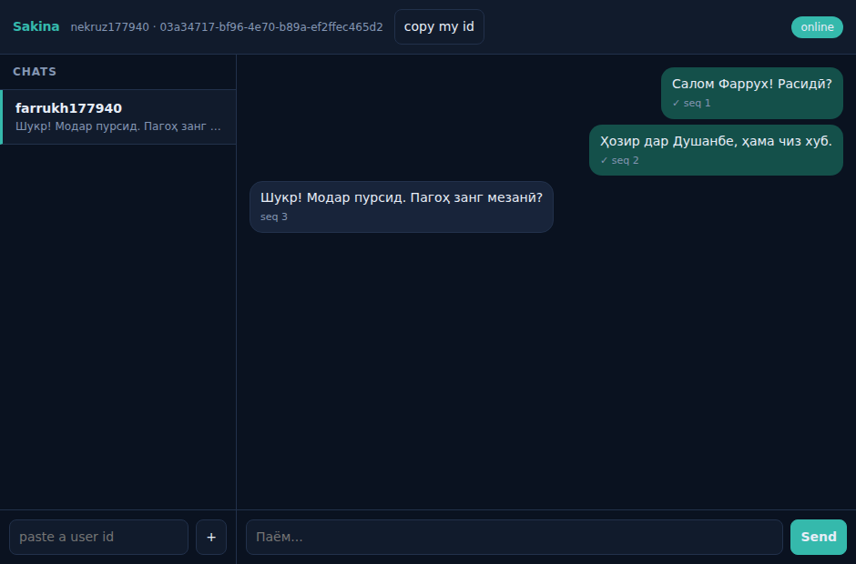

# How to test Sakina

Four levels, cheapest first. The first three need nothing but Docker and Node —
no Flutter SDK, no emulator, no phone.

---

## 0. Start the stack

```bash
pnpm install
pnpm infra:up          # postgres + redis + minio
pnpm build
pnpm db:migrate
pnpm dev               # api :4000, gateway :4001
```

Check it came up:

```bash
curl localhost:4000/health
curl localhost:4001/health
```

The API health response tells you which mode it is in — `email_provider`,
`otp_dev_mode`, `invite_only`. With `OTP_DEV_MODE=true` (the default) the
verification code comes back in the HTTP response, so **nothing needs
configuring to sign in.**

---

## 1. Automated — the fastest verdict

```bash
pnpm test
```

Eight suites, 132 checks:

| Suite | What it proves |
| --- | --- |
| `pnpm test:auth` | 15 checks. Every Gmail and Yandex address variant lands on **one** account; non-Gmail dots stay distinct; disposable domains refused; reserved test identities work but stay contained; one device cannot farm accounts. |
| `pnpm test:bans` | 10 checks. A banned user with a **new email on the same handset** is refused. Also asserts the honest limits — a factory reset gets through. |
| `pnpm test:messaging` | 24 checks. Two users exchange Tajik text; a retried send whose ack was lost does **not** duplicate; a client that went offline catches up; non-members are refused. |
| `pnpm test:social` | 48 checks. Groups, channels and attachments. A channel subscriber is refused at **every** entry point, not just shown a hidden composer; a removed member loses history *and* media; a key from one chat cannot be redeemed for another; `text/html` and SVG are refused outright; a full upload round trip returns the same bytes. Needs `STORAGE_PROVIDER=local`. |
| `pnpm test:l10n` | 7 checks. Every user-facing string exists in all three languages; every key the UI asks for is defined — `t()` returns the key itself on a miss, so a typo ships as a button labelled `chanel_name`; the six Tajik characters appear in real copy. |
| `pnpm test:motion` | 7 checks. Every animating file reaches the reduce-motion gate; every duration comes from the vocabulary in `motion.dart` rather than being written at the call site; the gate returns exactly `Duration.zero`, because shortening an animation is not disabling it. Verified to catch both failure modes by deliberately introducing each. |
| `pnpm test:dart` | 4 checks. Imports resolve, packages are declared, brackets balance, no Sakina-named symbol is referenced but undefined. Not a compiler — see below. |
| `pnpm test:push` | 17 checks. A device with the app **closed** gets a notification; a device with it **open** does not; the sender is never notified of their own message; no message text appears in the payload; a dead token is retired rather than retried forever. Needs the worker running with `PUSH_PROVIDER=console`. |

Each prints a tick per check and exits non-zero on failure. Run them after any
change to auth or the protocol.

Two more that are not in `pnpm test` because they need a browser:

| | |
| --- | --- |
| `pnpm test:devices` | 16 checks. The layout at 31 real device sizes — iPhone 11 through 17, Galaxy S/A/Fold/Flip, tablets — including a real browser at every viewport. See [`DEVICES.md`](DEVICES.md) |
| `pnpm test:browser` | 13 checks. Two real browser tabs exchanging messages |

**The server configuration the suites expect.** They assert real limits, so the
server has to be running with the limits they assert. `test:auth` checks that one
device *cannot* farm accounts, which means `MAX_SIGNUPS_PER_DEVICE` must be at
its default of 3 — but the same suite creates a dozen accounts from one address,
so the per-IP ceiling has to be lifted and the resend cooldown turned off:

```bash
MAX_SIGNUPS_PER_DEVICE=3 MAX_SIGNUPS_PER_IP=1000000 \
OTP_RESEND_COOLDOWN_SECONDS=0 TEST_IDENTITIES="qa@sakina.tj:000000" \
STORAGE_PROVIDER=local pnpm dev
```

Getting this wrong produces two failures that look like regressions and are not:
a reserved identity that cannot sign in (no `TEST_IDENTITIES`) and an
anti-abuse limit that never fires (per-device raised). Both are the suite
correctly reporting that the server is not configured the way it claims.

---

## 2. By hand, in a browser — the one you actually want

The automated suites prove the protocol. This one lets you *see* it.

```bash
pnpm dev:client        # serves tools/dev-client on :4002
```

Open **http://localhost:4002 in two tabs** (use one normal tab and one private
window — sessions are per-tab so each is a separate device).

1. Sign in on each tab with a different email. Any address works; the code is
   filled in automatically.
2. On tab one, press **copy my id**.
3. On tab two, paste it into *paste a user id* and press **+**.
4. Type. Messages appear on the other tab instantly.



Things worth trying, because they are the claims the whole architecture rests on:

| Try this | What should happen |
| --- | --- |
| Send a message | The bubble appears **before** the server replies (clock → tick) |
| Watch the `seq` under each bubble | 1, 2, 3 — gapless, identical on both sides |
| Open devtools → Network → set **Offline**, then send | The bubble stays, marked pending. Go back online: it sends. |
| Close one tab, send several messages, reopen it | Everything missed arrives on reconnect |
| Stop the gateway (`Ctrl-C`), watch the status pill | Goes to `offline`, reconnects on its own with backoff |
| Sign in on a **third** tab with the same email | Both tabs get the message — multi-device |

To drive that automatically in real Chromium:

```bash
pnpm add -Dw playwright     # not a repo dependency — it pulls a browser download
pnpm test:browser
```

It opens two browser contexts, signs in as two users, exchanges Tajik messages,
kills one socket mid-conversation and asserts the missed message arrives on
reconnect.

> The dev client is a **test harness, not the product**. It is deliberately
> plain and it is not what users will see — the real client is `apps/mobile`.

---

## 3. Poking the API directly

Useful when you want to see the shape of a response.

```bash
# request a code (dev mode returns it)
curl -s localhost:4000/v1/auth/otp/request \
  -H 'content-type: application/json' \
  -d '{"identity":{"kind":"email","value":"you@example.com"},"locale":"tg"}'

# sign in with it
curl -s localhost:4000/v1/auth/otp/verify \
  -H 'content-type: application/json' \
  -d '{"identity":{"kind":"email","value":"you@example.com"},
       "code":"123456",
       "device":{"device_id":"'"$(uuidgen)"'","platform":"android","name":"curl"}}'
```

Testing on a real handset, where the app swallows the JSON and you never see the
code:

```bash
curl -s localhost:4000/v1/auth/dev/inbox
```

That route only exists while `OTP_DEV_MODE=true`, and the API refuses to boot
with that on in production — so in production it is absent rather than guarded.

### Switching modes

Restart the API with different env to exercise other paths:

```bash
REQUIRE_INVITE=true pnpm dev          # signup now needs an invite code
OTP_DEV_MODE=false pnpm dev           # dev_code gone, dev inbox 404s
ALLOWED_EMAIL_DOMAINS=tnu.tj pnpm dev # university-only pilot
```

---

## 4. The Flutter app — the real client

**This has never been compiled.** It was written in an environment with no Dart
SDK, so expect analyzer complaints on the first run. The backend it talks to is
verified; the client is not.

```bash
cd apps/mobile
flutter create . --platforms=android,ios --org tj.sakina --project-name sakina
flutter pub get
flutter analyze          # do this first — fix what it finds

# Android emulator: 10.0.2.2 is the host machine
flutter run \
  --dart-define=API_URL=http://10.0.2.2:4000 \
  --dart-define=WS_URL=ws://10.0.2.2:4001/ws
```

On a physical phone, use your machine's LAN IP instead of `10.0.2.2`, and make
sure the phone is on the same wifi.

The single most important thing to test here is **not** in any automated suite:
**how it behaves on a real bad connection.** Turn on airplane mode mid-send.
Walk into a lift. Switch from wifi to mobile data mid-conversation. That is the
product claim, and it is only provable on real hardware on a real network.

---

## 5. Performance

```bash
pnpm bench:throughput   # gateway latency at realistic load, plus saturation
pnpm bench:fps          # frame rate under a burst, at 4x CPU throttle
```

Both have a pass/fail bar rather than just printing numbers. Full write-up,
including the before-and-after of the 60fps work, in
[`docs/PERFORMANCE.md`](PERFORMANCE.md).

---

## What cannot be tested yet

Being straight about the gaps, because a green test run can otherwise read as
"finished":

| | Status |
| --- | --- |
| **Push on a real handset** | The server path is built and tested end to end with a recording provider. What is untested is FCM and APNs themselves, which needs a Firebase project and a physical phone — see `docs/PUSH.md`. |
| **Calls** | Not built. Design in `docs/CALLS.md`. |
| **Media, groups, stickers** | Not built. M1. |
| **Device attestation** | Server side done and tested. The Flutter client does not yet collect ANDROID_ID or DeviceCheck tokens — see `docs/BANS.md`. |
| **Flutter frame rate on a device** | The client optimisations are reasoned from the browser profile, not measured — no Dart SDK here. Needs `flutter run --profile` on a cheap Android. |
| **Load beyond 40 sockets** | The throughput benchmark runs 20 chats. Thousands of concurrent connections, large groups, and deep history are all untested — see `docs/PERFORMANCE.md`. |
| **Real network conditions** | Only testable on a phone in Tajikistan on a real cell. This is the one that matters most and the one this environment cannot reach. |
